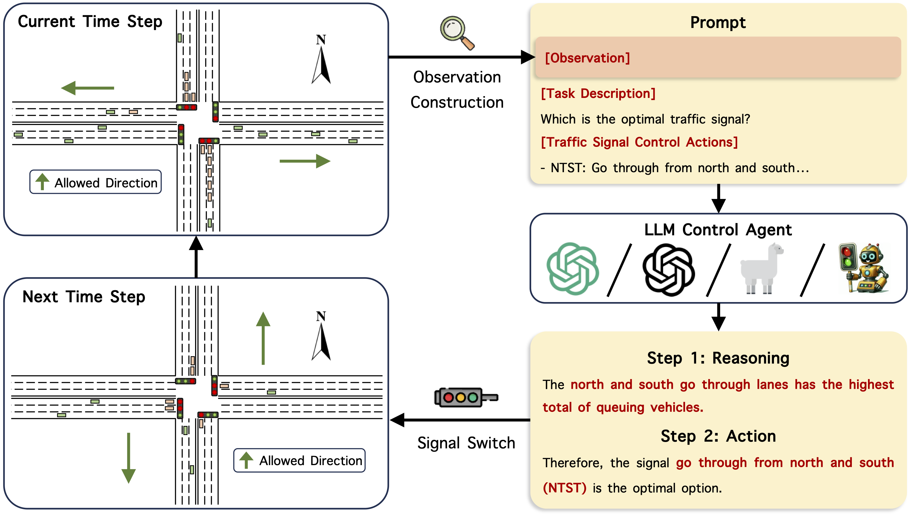

# LLMLight: Large Language Models as Traffic Signal Control Agents

[](https://gungnir2099.github.io/LLMLight-Page/)

<p align="center">


</p>

<p align="center">

| **[1 Introduction](#introduction)** 
| **[2 Requirements](#requirements)**
| **[3 Usage](#usage)**
| **[4 Baselines](#baselines)**
| **[5 LightGPT Training](#lightgpt-training)** 
| **[6 Code structure](#code-structure)** 
| **[7 Datasets](#datasets)**
| **[8 Citation](#citation)**
| **[Website](https://gungnir2099.github.io/LLMLight-Page/)** |

</p>

<a id="introduction"></a>
## 1 Introduction

Official code for article "[LLMLight: Large Language Models as Traffic Signal Control Agents](https://arxiv.org/abs/2312.16044)".

Traffic Signal Control (TSC) is a crucial component in urban traffic management, aiming to optimize road network efficiency and reduce congestion. Traditional methods in TSC, primarily based on transportation engineering and reinforcement learning (RL), often exhibit limitations in generalization across varied traffic scenarios and lack interpretability. This paper presents LLMLight, a novel framework employing Large Language Models (LLMs) as decision-making agents for TSC. Specifically, the framework begins by instructing the LLM with a knowledgeable prompt detailing real-time traffic conditions. Leveraging the advanced generalization capabilities of LLMs, LLMLight engages a reasoning and decision-making process akin to human intuition for effective traffic control. Moreover, we build LightGPT, a specialized backbone LLM tailored for TSC tasks. By learning nuanced traffic patterns and control strategies, LightGPT enhances the LLMLight framework cost-effectively. Extensive experiments on nine real-world and synthetic datasets showcase the remarkable effectiveness, generalization ability, and interpretability of LLMLight against nine transportation-based and RL-based baselines.

The code structure is based on [Efficient_XLight](https://github.com/LiangZhang1996/Efficient_XLight.git).



### Watch Our Demo Video Here:
https://github.com/usail-hkust/LLMTSCS/assets/62106026/90567f61-5d58-4dac-8c8e-836a421f3ff9


<a id="requirements"></a>
## 2 Requirements

`python>=3.9`,`tensorflow-cpu=2.8.0`, `cityflow`, `pandas=1.5.0`, `numpy=1.26.2`, `wandb`,  `transformers=4.36.2`, `peft=0.7.1`, `accelerate=0.25.0`, `datasets=2.16.1`, `fire`

[`cityflow`](https://github.com/cityflow-project/CityFlow.git) needs a Linux environment, and we run the code on Ubuntu.

<a id="usage"></a>

## 3 Usage

Parameters are well-prepared, and you can run the code directly.

- For example, to run `Advanced-MPLight`:
```shell
python run_advanced_mplight.py --dataset hangzhou \
                               --traffic_file anon_4_4_hangzhou_real.json \
                               --proj_name TSCS
```
- To run GPT-3.5/GPT-4 with LLMLight, you need to set your key in `./models/chatgpt.py`:

```python
headers = {
    "Content-Type": "application/json",
    "Authorization": "YOUR_KEY_HERE"
}
```

Then, run LLMLight by:

```shell
python run_chatgpt.py --prompt Commonsense \
                      --dataset hangzhou \
                      --traffic_file anon_4_4_hangzhou_real.json \
                      --gpt_version gpt-4 \
                      --proj_name TSCS
```
You can either choose `Commonsense` or `Wait Time Forecast` as the `prompt` argument.

- To run open-sourced LLMs with LLMLight:

```shell
python run_open_LLM.py --llm_model LLM_MODEL_NAME_ONLY_FOR_LOG \
                       --llm_path LLM_PATH \
                       --dataset hangzhou \
                       --traffic_file anon_4_4_hangzhou_real.json \
                       --proj_name TSCS
```
<a id="baselines"></a>

## 4 Baselines

- **Heuristic Methods**:
    - FixedTime, Maxpressure, EfficientMaxPressure
- **DNN-RL**:
    - PressLight, MPLight, CoLight, AttendLight, EfficientMPLight, EfficientPressLight, Efficient-Colight
- **Adv-DNN-RL**:
    - Advanced-MaxPressure, Advanced-MPLight, Advanced-Colight
- **LLMLight+LLM**:
  - `gpt-3.5-turbo-0613`, `gpt-4-0613`, `llama-2-13b-chat-hf`, `llama-2-70b-chat-hf`
- **LLMLight+LightGPT**:
    - The model trained on Jinan 1 is available at https://huggingface.co/USAIL-HKUSTGZ/LLMLight-LightGPT

<a id="lightgpt-training"></a>

## 5 LightGPT Training

### Step 1: Imitation Fine-tuning

```shell
python ./finetune/run_imitation_finetune.py --base_model MODEL_PATH \
                                            --data_path DATA_PATH \
                                            --output_dir OUTPUT_DIR
                                            
python ./finetune/merge_lora.py --adapter_model_name="OUTPUT_DIR" \
                                --base_model_name="MODEL_PATH" \
                                --output_name="MERGED_MODEL_PATH"
```

We merge the adapter with the base model by running `merge_lora.py`.

### Step 2: Policy Refinement Data Collection

- You first need to train `Advanced-CoLight` by running:

```shell
python run_advanced_colight.py --dataset hangzhou \
                               --traffic_file anon_4_4_hangzhou_real.json \
                               --proj_name TSCS
```

The RL model weights will be automatically saved in a checkpoint folder in `./model`. You need to copy it and put it under the `./model_weights/AdvancedColight/{traffic_file}/"` folder.

- Then, collect the data by running:

```shell
python ./finetune/run_policy_refinement_data_collection.py --llm_model MODEL_NAME_ONLY_FOR_LOG \
                                                           --llm_path MODEL_PATH \
                                                           --dataset hangzhou \
                                                           --traffic_file anon_4_4_hangzhou_real.json
```

The fine-tuning data will be ready at `./data/cgpr/cgpr_{traffic_file}.json`.

### Step 3: Critic-guided Policy Refinement

```shell
python ./finetune/run_policy_refinement.py --llm_model MODEL_NAME_ONLY_FOR_LOG \
                                           --llm_path MODEL_PATH \
                                           --llm_output_dir OUTPUT_DIR \
                                           --dataset hangzhou \
                                           --traffic_file anon_4_4_hangzhou_real.json \
                                           --proj_name LightGPTFineTuning
                                           
python ./finetune/merge_lora.py --adapter_model_name="OUTPUT_DIR_{traffic_file}" \
                                --base_model_name="MODEL_PATH" \
                                --output_name="MERGED_MODEL_PATH"
```

Similarly, we merge the adapter with the base model by running `merge_lora.py`.

<a id="code-structure"></a>

## 6 Code structure

- `models`: contains all the models used in our article.
- `utils`: contains all the methods to simulate and train the models.
- `frontend`: contains visual replay files of different agents.
- `errors`: contains error logs of ChatGPT agents.
- `{LLM_MODEL}_logs`: contains dialog log files of a LLM.
- `prompts`: contains base prompts of ChatGPT agents.
- `finetune`: contains codes for LightGPT training.

<a id="datasets"></a>
## 7 Datasets

<table>
    <tr>
        <td> <b> Road networks </b> </td> <td> <b> Intersections </b> </td> <td> <b> Road network arg </b> </td> <td> <b> Traffic files </b> </td>
    </tr>
    <tr> <!-- Jinan -->
        <th rowspan="4"> Jinan </th> <th rowspan="4"> 3 X 4 </th> <th rowspan="4"> jinan </th>  <td> anon_3_4_jinan_real </td> 
    </tr>
  	<tr>
      <td> anon_3_4_jinan_real_2000 </td>
  	</tr>
  	<tr>
      <td> anon_3_4_jinan_real_2500 </td>
    </tr>
    <tr>
      <td> anon_3_4_jinan_synthetic_24000_60min </td>
    </tr>
  	<tr> <!-- Hangzhou -->
        <th rowspan="3"> Hangzhou </th> <th rowspan="3"> 4 X 4 </th> <th rowspan="3"> hangzhou </th> <td> anon_4_4_hangzhou_real </td>
    </tr>
  	<tr>
      <td> anon_4_4_hangzhou_real_5816 </td>
    </tr>
    <tr>
      <td> anon_4_4_hangzhou_synthetic_32000_60min </td>
    </tr>
  <tr> <!-- Newyork -->
        <th rowspan="2"> New York </th> <th rowspan="2"> 28 X 7 </th> <th rowspan="2"> newyork_28x7 </th> <td> anon_28_7_newyork_real_double </td>
    </tr>
  	<tr>
      <td> anon_28_7_newyork_real_triple </td>
    </tr>
</table>

<a id="citation"></a>

## 8 Citation

```
@misc{lai2024llmlight,
      title={LLMLight: Large Language Models as Traffic Signal Control Agents}, 
      author={Siqi Lai and Zhao Xu and Weijia Zhang and Hao Liu and Hui Xiong},
      year={2024},
      eprint={2312.16044},
      archivePrefix={arXiv},
      primaryClass={cs.AI}
}
```
