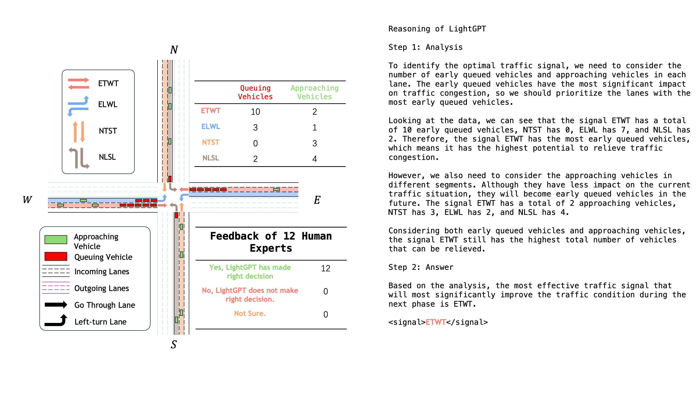
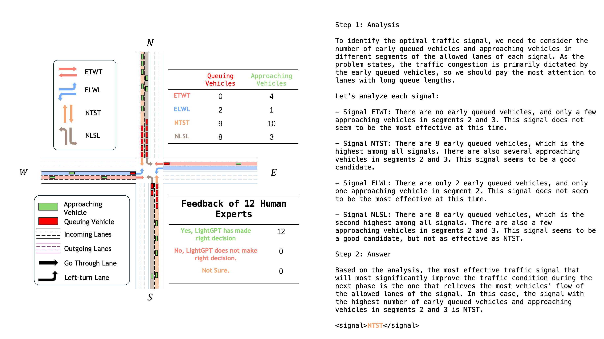
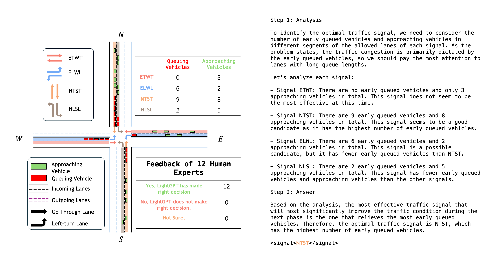
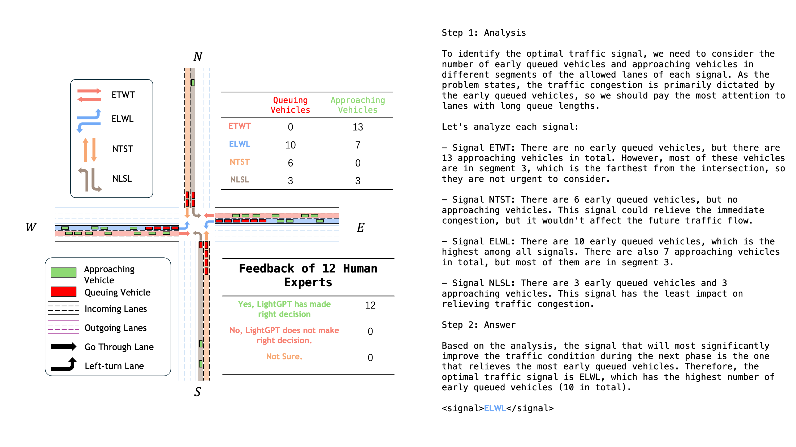
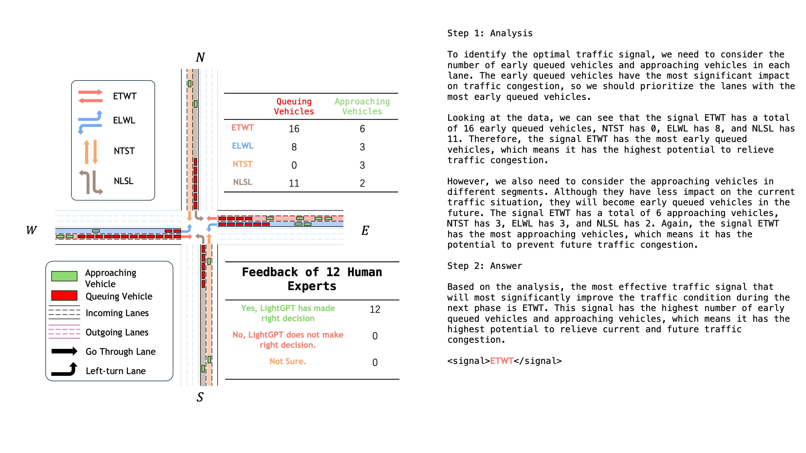

# Survey on the Reasoning and Decision-making Ability of LLMLight (equipped with LightGPT)

**Note**: This survey involves five randomly selected scenarios, aiming to evaluate LLMLight's reasoning and decision-making capabilities under diverse traffic environments. Feedback was solicited from a diverse group, including **two traffic management experts**, **eight experienced drivers**, and **two AI specialists**. 

## Case 1

## Case 2

## Case 3

## Case 4

## Case 5

