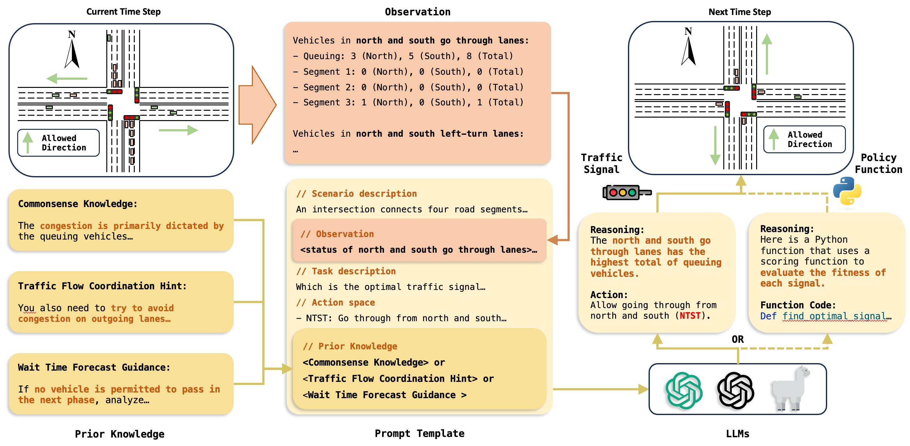

# Large Language Models as Traffic Signal Control Agents: Capacity and Opportunity

<p align="left">


</p>


<p align="left">
  
| **[1 Introduction](#introduction)** 
| **[2 Requirements](#requirements)**
| **[3 Usage](#usage)**
| **[4 Baselines](#baselines)**
| **[5 Code structure](#code-structure)** 
| **[6 Datasets](#datasets)**|


</p>

<a id="introduction"></a>
## 1 Introduction

Official code for article "Large Language Models as Traffic Signal Control Agents: Capacity and Opportunity".

Traffic signal control is crucial for optimizing the efficiency of road network by regulating traffic light phases. Existing research predominantly focuses on heuristic or reinforcement learning (RL)-based methods, which often lack transferability across diverse traffic scenarios and suffer from poor interpretability. This paper introduces a novel approach, LLMLight, utilizing large language models (LLMs) for traffic signal control tasks. By leveraging LLMs' impressive generalization and zero-shot reasoning capabilities, LLMLight executes a human-like decision-making process for efficient traffic management. Specifically, the framework begins by composing task descriptions, current traffic conditions, and prior knowledge into a prompt. Subsequently, we utilize LLM's chain-of-thought (CoT) reasoning ability to identify the next traffic signal phase, ensuring optimal efficiency in the road network. LLMLight achieves state-of-the-art (SOTA) or competitive results across five real-world traffic datasets. Notably, LLMLight showcases remarkable generalization, interpretability, and zero-shot reasoning abilities, even without any training for transportation management tasks.

The code structure is based on [Efficient_XLight](https://github.com/LiangZhang1996/Efficient_XLight.git).



### Watch Our Demo Video Here:
https://github.com/usail-hkust/LLMTSCS/assets/62106026/1ff2206d-9d27-4bab-929b-4c948e6b4d86

<a id="requirements"></a>
## 2 Requirements

`python=3.9`,`tensorflow=2.8`, `cityflow`, `pandas=1.5.0`, `numpy=1.26.2`, `wandb`,  `transformers=4.37.0`, `accelerate=0.25.0`, `fastapi`, `uvicorn`

[`cityflow`](https://github.com/cityflow-project/CityFlow.git) needs a linux environment, and we run the code on Ubuntu.

<a id="usage"></a>
## 3 Usage

Parameters are well-prepared, and you can run the code directly.

- For axample, to run `Advanced-MPLight`:
```shell
python run_advanced_mplight.py --dataset jinan --traffic_file anon_4_4_hangzhou_real.json
```
- To run OpenAI LLM agent, you need to set your key in `./models/chatgpt.py`:

```python
headers = {
    "Content-Type": "application/json",
    "Authorization": "YOUR_KEY_HERE"
}
```

Then, run the OpenAI LLM traffic agent:


```shell
python run_chatgpt_commonsense.py --dataset jinan --traffic_file anon_4_4_hangzhou_real.json --gpt_version gpt-4
```
- To run open LLMs, you can either run an API backend:
```shell
python open_llm_api.py --workers 2
```
Then, run the open LLM traffic agent:

```shell
python run_open_llm_commonsense.py --dataset jinan --traffic_file anon_4_4_hangzhou_real.json --llm_model llama_2_13b_chat_hf --llm_api_thread_num 2 --with_external_api false
```
**Note:**

- **You first need to download your LLM and put it under the `./llm_models` directory**.
- **You should set the number of workers of the open LLM api backend and the traffic agent the same.**

Or, you can also run with Perplexity API by setting your key in `./models/open_sourced_llm_models.py`:

```python
ex_headers = {
    "accept": "application/json",
    "content-type": "application/json",
    "Authorization": "YOUR_PERPLEXITY_KEY_HERE"
}
```

Then, run the open LLM traffic agent:

```shell
python run_open_llm_commonsense.py --dataset jinan --traffic_file anon_4_4_hangzhou_real.json --llm_model llama_2_13b_chat_hf --llm_api_thread_num 2 --with_external_api true
```

<a id="baselines"></a>
## 4 Baselines

- **Heuristic Methods**:
    - Fixedtime, MaxPressure, EfficientMaxPressure
- **DNN-RL**:
    - PressLight, MPLight, CoLight, AttendLight, EfficientMPLight, EfficientPressLight, EfficientColight
- **Adv-DNN-RL**:
    - AdvancedMaxPressure, AdvancedMPLight, AdvancedColight
- LLMs:
  - `gpt-3.5-turbo-0613`, `gpt-4-0613`, `llama-2-13b-chat-hf`, `llama-2-70b-chat-hf`

<a id="code-structure"></a>
## 5 Code structure
- `models`: contains all the models used in our article.
- `utils`: contains all the methods to simulate and train the models.
- `frontend`: contains visual replay files of different agents.
- `errors`: contains error logs of ChatGPT agents.
- `{LLM_MODEL}_logs`: contains dialog log files of a LLM.
- `prompts`: contains base prompts of ChatGPT agents.

<a id="datasets"></a>
## 6 Datasets

<table>
    <tr>
        <td> <b> Road networks </b> </td> <td> <b> Intersections </b> </td> <td> <b> Road network arg </b> </td> <td> <b> Traffic files </b> </td>
    </tr>
    <tr> <!-- Jinan -->
        <th rowspan="4"> Jinan </th> <th rowspan="4"> 3 X 4 </th> <th rowspan="4"> jinan </th>  <td> anon_3_4_jinan_real.json </td> 
    </tr>
  	<tr>
      <td> anon_3_4_jinan_real_2000.json </td>
  	</tr>
  	<tr>
      <td> anon_3_4_jinan_real_2500.json </td>
    </tr>
    <tr>
      <td> anon_3_4_jinan_synthetic_4000_10min.json </td>
    </tr>
  	<tr> <!-- Hangzhou -->
        <th rowspan="3"> Hangzhou </th> <th rowspan="3"> 4 X 4 </th> <th rowspan="3"> hangzhou </th> <td> anon_4_4_hangzhou_real.json </td>
    </tr>
  	<tr>
      <td> anon_4_4_hangzhou_real_5816.json </td>
    </tr>
    <tr>
      <td> anon_4_4_hangzhou_synthetic_4000_10min.json </td>
    </tr>
  	<tr> <!-- NewYork -->
        <th rowspan="1"> New York-16X3 </th> <th rowspan="1"> 16 X 3 </th> <th rowspan="1"> newyork_16x3 </th> <td> anon_16_3_newyork_real.json </td>
    </tr>
  <tr> <!-- Hangzhou -->
        <th rowspan="2"> New York-28X7 </th> <th rowspan="2"> 28 X 7 </th> <th rowspan="2"> newyork_28x7 </th> <td> anon_28_7_newyork_real_double.json </td>
    </tr>
  	<tr>
      <td> anon_28_7_newyork_real_triple.json </td>
    </tr>
</table>
